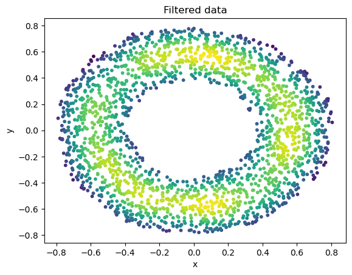

# 📉Background-Signal-Analysis 


A project made to filter the true signal from the background of a detector.

This project goes through one of the most important topics of experimental physics: distinguishing the noise of a detector from the real detection. With the use of Machine Learning and Montecarlo methods, one can filter the noise to obtain the real data.

## ⚛️The experiment

The premise is simple: we have a detector of dimensions $1\times 1$ (adimensional) that records each point where a particle has collided. We know for sure that some of the detections may not correspond to the particles we really want to detect and they are considered noise. 

The goal is to classify each detection with two labels: **Background** and **Signal**. To do so, we can make use of 2 Montecarlo-generated datasets corresponding to each type of data to train a neural network to do the job.

## 📑Dataset

The 3 files used are simple data:

* [``dataset.txt``]() The detections we want to filter.
* [``mc_bkg.txt``]() The Montecarlo generated background sample.
* [``mc_signal.txt``]() The Montecarlo generated signal sample.

All of them are two columns corresponding to the $X$ and $Y$ coordinates, separated by a ``tab``. Example:
```file
     X             Y       
=======================
0.8110		-0.0370
0.2074		0.7868
0.8212		0.4156
```

So we will have to skip the first two rows when reading.

## ♟️Strategy

To accomplish our task, we will be using the ``scikit-learn`` library, which allows us to use ``MLPRegressor()`` as a simple Neural Network model.

In an ideal world, our Neural Network $N$ would work the following way:

```math
\begin{align}
\begin{pmatrix} & & \\ & N & \\ & & \end{pmatrix}\begin{pmatrix} x \\ y \end{pmatrix} = 1&\text{if (x, y) is Background}\\
\begin{pmatrix} & & \\ & N & \\ & & \end{pmatrix}\begin{pmatrix} x \\ y \end{pmatrix} = 0&\text{if (x, y) is Signal}
\end{align}
```

To our eyes, $N$ works just as a _black box_. It takes inputs and gives outputs. The issue is that, once trained, the output will not be a binary number but a number between 0 and 1 (approximately). Our task will also be determining where do we cut the classification (At 0.5? At 0.7? We will see...).

The strategy is the following:

1. Train the Neural Network with half of the Montecarlo sample assigning 1 to the Background and 0 to the Signal.
2. Check if the training has been succesful comparing with the other half.
3. Define $T_{cut}$ with a hypothesis testing.
4. Obtain the output values $T$ for the dataset and mask them with $T<T_{cut}$.
5. plot the resulting data and compare it with the Montecarlo sample.


## 🔰Start the project

The first step is to import all the necessary packages.

```python
import numpy as np
import matplotlib.pyplot as plt
import scipy as sp
from scipy.optimize import curve_fit
from scipy.stats import norm
from statistics import NormalDist
import plotly.express as px
from scipy.stats import gaussian_kde

#machine learning packages
from sklearn.neural_network import MLPRegressor
from sklearn.metrics import mean_squared_error
```

## 👓Read the data

We simply read de data and store it in different variables. (skipping the first two rows, as we said)

```python
# read the data
data = np.loadtxt('DataSet/dataset.txt', unpack=True, skiprows=2).transpose()

# Read the montecarlo samples
MCb = np.loadtxt('DataSet/mc_bkg.txt', unpack=True, skiprows=2)
MCs = np.loadtxt('DataSet/mc_signal.txt', unpack=True, skiprows=2)
```

We, now want to classify the Montecarlo data in two different types: **Data used to train** and **Data used to predict**, separating them with the half of the sample ``l//2``. Also, ``zeros`` and ``ones`` correspond to the expected output values of the Newural Network, those are the ones that we impose it to fit.

```python
# define the length of the data
l = len(MCs.transpose())

# first half training
MCs_train = MCs.transpose()[0:l//2]
MCb_train = MCb.transpose()[0:l//2]

# second half predicting
MCs_predict = MCs.transpose()[l//2:]
MCb_predict = MCb.transpose()[l//2:]

# defining noise or signal output
zeros = np.zeros(int(l/2)).transpose()
ones = np.ones(int(l/2)).transpose()

# joint samples train
train_sample = np.concatenate((MCb_train,MCs_train))
train_output = np.concatenate((ones,zeros))

# joint samples predict
predict_sample = np.concatenate((MCb_predict, MCs_predict))
```

(notice how we use the ``.transpose()`` method, the Neural Network identifies row vectors as the single output, listed in a single column)

## 🏋️Train the Neural Network

We define a Neural Network (``MLPRegressor()``) with some parameters and train it with the ``.fit`` method, making it match the ``train_sample`` with its desired ``train_output``.

```python
# define the network
mlp = MLPRegressor(hidden_layer_sizes = (100, 50), max_iter = 1000, random_state = 21)

# train the network
mlp.fit(train_sample, train_output)
```

Apply the ``predict_sample`` to the Neural Network and save the output.

```python
# predict
predict_output = mlp.predict(predict_sample)
```
Now, we plot the distributions of the outputs. Since we used ``np.concatenate()`` we know that the first half of the full sample should correspond to **Background** and the other one to **Signal**.
The resulting histograms (when normalizing them) should correspond to the probability density distributions (_pdf_'s) of a particle being classified (by the Network) with a certain value $T$.

```python
# plot the pdfs
nbins = 200
ay = plt.hist(predict_output, bins = nbins, color = 'green', label = r'Full sample $\rho(T)$')[0]

Back = predict_output[:l//2]
Signal = predict_output[l//2:]

by = plt.hist(Back, bins = nbins, color = 'red', alpha=0.5, label = r'Estimated background pdf $\rho(T|B)$')[0]
bx = np.histogram(Back, bins = nbins)[1]

sy = plt.hist(Signal, bins = nbins, color = 'blue', alpha=0.5, label = r'Estimated signal pdf $\rho(T|S)$')[0]
sx = np.histogram(Signal, bins = nbins)[1]

plt.legend(loc='best')
plt.xlabel("Output value")
plt.ylabel("Count")
plt.show()
```


## 🤔Hypothesis Testing

Now that our Neural Network is trained, we want to study the probability of a certain value being assigned as **Background** or **Signal**.
Luckily, since we have the Montecarlo samples, we can extract from our previous knowledge the (approximate) _pdf_'s corresponding to those cases, $\rho(T|S)$ and $\rho(T|B)$. The corresponding _pdf_'s can be identified as the normalized histograms of the **Background** and **Signal** samples:

```python
# define the pdfs
by = plt.hist(Back, bins = nbins, color = 'red', alpha = 0.6, label = r'Estimated background pdf $\rho(T|B)$', density = True)[0]
bx = np.histogram(Back, bins=nbins)[1]
sy = plt.hist(Signal, bins = nbins,color = 'blue', alpha = 0.6, label = r'Estimated signal pdf $\rho(T|S)$', density = True)[0]
sx = np.histogram(Signal, bins = nbins)[1]
```

From now on, we will treat all the data as signal when its $T$ value (assigned by the Neural Network) is below $T_{cut}$ and vicebersa:

```math
\begin{align}
(x,y)="\text{signal}"\Leftrightarrow T(x,y) \in (-\infty,T_{cut})\\
(x,y)="\text{background}"\Leftrightarrow T(x,y) \in (T_{cut},+\infty)
\end{align}
```

We define $\alpha$ as the probability of a signal being incorrectly labeled as **Background**. $\alpha = P(B|S)$. That is, the following expression:

```math
\alpha = \int_{T_{cut}}^{+\infty}\rho(T|S)dT
```

The idea is fixing $\alpha$ to a low probability, for example, $0.05$ ($5$%). So, we will integrate the **Signal** _pdf_ until the area reaches $\alpha = 0.05$. The value where $T$ stops integrating is $T_{cut}$ (the integration is being done summing the heights multiplied by the bin length):

```python
# integrate the background pdf from the upper limit until the area is 0.05
alpha = 0.05
summ = 0
for j in range(len(sy) - 1, 0 - 1, -1):
    summ += sy[j] * (np.max(sx) - np.min(sx)) / nbins
    i = j
    if summ > alpha:
        break
# print the corresponding T_{cut}
print('Area = {}\nTcut = {}'.format(summ, sx[i]))

# plot the T_{cut} line
plt.axvline(sx[i], color = 'cyan', label = 'Tcut={:.2}'.format(sx[i]))
Tcut = sx[i]
plt.legend(loc = 'best')
plt.xlabel(r"Output value $T$")
plt.ylabel(r"Probability density $\rho$")
plt.show()
```

* $\alpha = 0.0514$
* $T_{cut} = 0.630$

So, when classifying our data, we will say it is **Background** whenever its $T$ value is over $T_{cut}$.

### 💪Power of the Test

The power is a value that allows us to evaluate how much **Background** are we really eliminating by using a certain $T_{cut}$. The probability $\beta$ of wrongly classifying as **Signal** a **Background** value is:

```math
\beta=\int_{-\infty}^{T_{cut}}\rho(T|B)dT
```

So, the complementary probability $(1-\beta)$ gives us the probability of correctly assigning as **Background** a **Background** data.

```python
# calculate power
beta = 0
for j in range(0,i):
    beta += by[j] * (np.max(bx) - np.min(bx)) / nbins
print('Power = {}'.format(1 - beta))

# calculate the areas below Tcut
Sarea = 0
Barea = 0
for i in range(0,100000):
    if sx[i] >= Tcut and by[i] >= Tcut:
        break
    Sarea += sy[i] * (np.max(sx) - np.min(sx)) / nbins
    Barea += by[i] * (np.max(bx) - np.min(bx)) / nbins

print('Signal area = {}\nBackground area = {}'.format(Sarea, Barea))
```

* $1-\beta =0.574$
* Signal area $= 0.954$
* Background area $= 0.434$

The conclusion is that our Neural Network is capable of eliminating $57.4$% of the **Background**!

## 📈Data Analysis

Now, we are ready to analyze our sample ``data.txt``.

First, we get the $T$ values by applying the ``.predict()`` method to our ``data``. The data assigned as **Signal** will be the one which is below $T_{cut}$, so we apply the corresponding mask.

```python
# predict T with the Neural Network
Fdata = mlp.predict(data)
Sdata = Fdata[Fdata < Tcut]
```

We can see the plot of the filtered data, it works as it should.

```python
dy = plt.hist(Fdata, bins = nbins, color = 'red', label = 'Real data', alpha = 0.6)[0]
dx = np.histogram(Fdata, bins = nbins)[1]

bins2 = int((np.max(Sdata) - np.min(Sdata)) / ((np.max(Fdata) - np.min(Fdata)) / nbins))
Dy = plt.hist(Sdata, bins = bins2, color = 'blue', label = 'Filtered data', alpha = 0.6)[0]
Dx = np.histogram(Sdata, bins = nbins)[1]

plt.xlabel(r'Output value $T$')
plt.ylabel(r'Count')
plt.legend()
plt.show()
```


Finally, we can plot the full ``data.txt`` sample and the filtered subsample. Using the ``gaussian_kde`` funciton to color it by density.

```python
realx=data.transpose()[0]
realy=data.transpose()[1]
xy = np.vstack([realx,realy])

# sort by color/density
z = gaussian_kde(xy)(xy)
idx = z.argsort()
realx, realy, z = realx[idx], realy[idx], z[idx]
fig, ax = plt.subplots()
Real=ax.scatter(realx, realy, c=z, s=10)

# plot
plt.title('Measured data')
plt.xlabel('x')
plt.ylabel('y')
plt.show()

#select the signal without the background
filtx=np.array([])
filty=np.array([])
for i in range(0,int(Fdata.size)):
    if Fdata[i]<Tcut:
        filtx=np.append(filtx,data[i,0])
        filty=np.append(filty,data[i,1])

#calculate density
xy = np.vstack([filtx,filty])

#sort by color/density
z = gaussian_kde(xy)(xy)
idx = z.argsort()
filtx, filty, z = filtx[idx], filty[idx], z[idx]
fig, ax = plt.subplots()
Filtered=ax.scatter(filtx, filty, c=z, s=10)

# plot
plt.title('Filtered data')
plt.xlabel('x')
plt.ylabel('y')
plt.show()
```

 

### 📊Plotting the Montecarlo sample

Just by curiosity, we can also plot the Montecarlo-generated sample
```python
# background montecarlo
Backgroundx = MCb[0]
Backgroundy = MCb[1]
xy = np.vstack([Backgroundx,Backgroundy])

# sort by color/density
z = gaussian_kde(xy)(xy)
idx = z.argsort()
Backgroundx, Backgroundy, z = Backgroundx[idx], Backgroundy[idx], z[idx]
fig, ax = plt.subplots()
Real = ax.scatter(Backgroundx, Backgroundy, c = z, s = 10)

# plot
plt.title('Background Montecarlo')
plt.xlabel('x')
plt.ylabel('y')
plt.show()

# signal montecarlo
Signalx = MCs[0]
Signaly = MCs[1]
xy = np.vstack([Signalx,Signaly])

# sort by color/density
z = gaussian_kde(xy)(xy)
idx = z.argsort()
Signalx, Signaly, z = Signalx[idx], Signaly[idx], z[idx]
fig, ax = plt.subplots()
Filtered = ax.scatter(Signalx, Signaly, c = z, s = 10)

# plot
plt.title('Signal Montecarlo')
plt.xlabel('x')
plt.ylabel('y')
plt.show()
```

 
